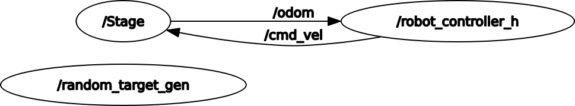
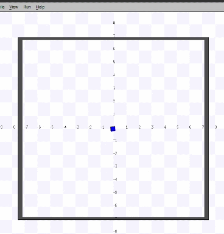
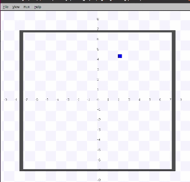

# Research Track 1: First Assignment 
#### Author's Name: __Omotoye__ Shamsudeen Adekoya
#### Student ID: __5066348__
---

# Outline 
* #### ROS Package Description
    * What the Package Does
    * How the Nodes in the Package works
    * Non Holonomic Control
* #### How to Compile and Launch the Package
* #### What behaviour should you expect to see after Launching the Package


# ROS Package Description
### What the Package Does
---
This package controls a holonomic robot in a 2d space with a simple 2d simulator, Stage. There are two nodes in the package;
1. The first node is in charge of:
    * Calling a service for receiving a random target
    * Making the robot reach the target
1. The second node will act as a __service Server__ by:
    * Replying the __Client__ with a random target having x and y in the interval (-6.0, 6.0)

### How the nodes in the Package works
---
The two nodes are written in python. The package is intended to run on the latest distribution of ROS 1, __ROS Noetic Ninjemys__  *(Release Date, May 23rd, 2020)*. ROS Noetic works with C++ and *(Exclusively)* __Python3__, so the code is written with a shebang line to a python3 compiler and also with some new features of python3. The package should be used with ROS Noetic to avoid errors. 

#### Node 1 ---> *Robot controller*
* The node sends a request for the cordinates of the next target
* It receives a response of an Object containing the x and y coordinates, which is the target to navigate the robot to.
* The controller needs the real-time x, y coordinates and the yaw axis of the robot in order to navigate the robot to the intended target. For this the controller node is subscribed to a topic called __"odom"__.
* The topic **"odom** provides the x and y pose of the robot. 


#### Node 2 ---> *Robot Server*
* This node listens for a request from the robot controller __(Client)__.
* Accepts the request and sends a response of a randomly generated coordinate between(-6.0, 6.0), code snippet below
```python
 # Random Target Generator
    rand_x = random.randint(-6.0, 6.0)
    rand_y = random.randint(-6.0, 6.0)
    print(f'The new target cordinate is x: {rand_x}, y: {rand_y}')
```
* For this type of communication to be possible a custom service had to be built. Code snippet below
```
string status
---
int8 cord_x
int8 cord_y
```
* The line before the --- represent the request message and the line after represents the response
* A request with string "Waiting for Target" or "Target Reached" is sent to the service and a response of type 8-bit int is sent back to the robot controller. After you run catkin_make to build your workspace, three header files will ge generated in the catkin_ws/devel/includes/rt_assignment_1 directory. The header files can then be imported by the client and the server as shown below
```python
from rt_assignment_1.srv import RandomTarget
from rt_assignment_1.srv import RandomTargetRequest
from rt_assignment_1.srv import RandomTargetResponse
```

#### How the Nodes Communicate
To see how all the nodes communicate, it can be best described by an rqt_graph as show below


* From the image, it is shown that the _/robot_controller_h_ is subscribed to the __odom__ topic of the __Stage__ node and the _/robot_controller_h_ is publishing to the _/cmd_vel_ topic.
* Notice how the */random_target_gen* is not connected, that's because the */random_target_gen* is a **service server** node. It only connects when the __client__ sends a request to it.

# Non Holonomic Contol

An additional node is added to control the robot as if it were a non-holonomic robot. The major difference between the two types of robot is that a holonomic robot can move on both x and y axis unlike a non-holonomic robot which can only move on the x axis. For a non-holonomic robot to navigate, the control of the yaw axis is required, this is show in the display below. 


The robot has to correct the yaw axis of the robot to the required yaw to reach the target before motion towards the target begins.Although the x and y coordinate is pretty easy to get from the Odom msg, the yaw axis needs an extra step

The Orientation returned by the odom object is in __quaternion__ which has to be converted to __euler's angles__ to make the computation easier. The code snippet below shows the steps taken for this conversion


```python
    rotation = pose_message.pose.pose.orientation
    quaternion = [rotation.x, rotation.y, rotation.z, rotation.w]

    # Using tuple unpacking to get the roll, pitch and yaw values for the euler tuple
    (roll, pitch, yaw) = euler_from_quaternion(quaternion)
```
* Algorithm for the non-holonomic robot Navigation:
    * Get the Robot Orientation angle and Angle to the target *(required robot orientation)*
    * Add or subtract from the robot orientation angle until the *abs(robot_orientation_angle - angle_to_the_target) < 0.1*
    * If *abs(robot_orientation_angle - angle_to_the_target) < 0.1*, then the robot is facing the right direction
    * Move the robot forward until the distance between the robot and the target is less than 0.1
    * The distance between the robot and the target can be caluculated at every instance with pythagoras theorem
    * If the distance between the robot and the target is less than 0.1, then the robot has gotten to the target.
* Code for some of the calculations is shown below.
```python
    dist_x = target.cord_x - current_position_x
    dist_y = target.cord_y - current_position_y
    required_yaw = atan2(dist_y, dist_x)
    distance_to_target = sqrt((dist_x*dist_x) + (dist_y*dist_y))
    return distance_to_target, required_yaw
```

However the control of the holonomic robot is easy.

* Algorithm for the non-holonomic robot Navigation:
    * Calculate the distance of the robot to the target
    * Divide the distance by the speed the robot would move at, to get the rate along the path to the target
    * Divide the dist of x and y cordinate by rate to the path to get the rate through each cordinate. 
    * move simultaneously at each of the calcuate rate for the x and y axis till the robot gets to the target. 

```python 
    dist_x = target.cord_x - current_position_x
    dist_y = target.cord_y - current_position_y

    distance_to_target = sqrt((dist_x * dist_x) + (dist_y * dist_y))
    required_x = (dist_x / (distance_to_target / SPEED))
    required_y = (dist_y / (distance_to_target / SPEED))
```
The holonomic control of the robot is shown below


# How to Compile and Launch the Package
### Compile
---
First you create a folder for your catkin workspace
```bash
mkdir -p ~/catkin_ws/src
```
Clone the package repository
```bash
cd ~/catkin_ws/src
git clone https://github.com/Omotoye/rt_assignment_1.git
```
Once the package has been successfully cloned, you then build the workspace
```bash
cd ~/catkin_ws/
catkin_make
```
### Launch
---
There are two ways to launch the package, one very easy and one not so easy. For either of the two ways, the first step is __Very Important__ and it's thesame for the two ways.

Step one, source the setup.bash file, if you followed the steps above, then you can enter the command below. 
```bash
source ~/catkin_ws/devel/setup.bash
```
If you didnt follow the initial steps because you already have a workspace, trace a path from you home directory to your catkin workspace down to your setup.bash file. An Example is shown below, __*THIS WILL NOT WORK FOR YOU, IT IS JUST AN EXAMPLE TO SHOW HOW IT CAN BE DONE*__
```bash
source /home/omotoye/Desktop/catkin_ws/devel/setup.bash
```
For the easy step a launch file has been created for launching all the required nodes for the simulation and control; in thesame terminal where you source the setup.bash file, run the command below for the holonomic control
```bash
roslaunch rt_assignment_1 holonomic_control.launch
```
run the command below for the non-holonomic control
```bash
roslaunch rt_assignment_1 non-holonomic_control.launch
```

For the __not so easy step__, you need to open four terminals, source the setup.bash in the four of them. 
run the command below to launch the ros master
```bash
roscore
```
Next you run the command below in one of the terminals with setup.bash sourced, to start the stageros simulator
```bash
rosrun stage_ros stageros $(rospack find rt_assignment_1)/world/exercise.world
```
Next you run the command below in one of the terminals with setup.bash sourced, to start the Service server
```bash
rosrun rt_assignment_1 remote_server.py
```
Next you run the robot controller in one of the terminals with setup.bash sourced; for holonomic control
```bash
rosrun rt_assignment_1 robot_controller_1.py
```
for non-holonomic control, run 
```bash
rosrun rt_assignment_1 robot_controller_2.py
```

_Again, this second method is not the recommended one, the first one is easy and compact, with all the feedbacks on one terminal_

<br/>


_For more information about the python scripts, go to docs/html/index.html_

